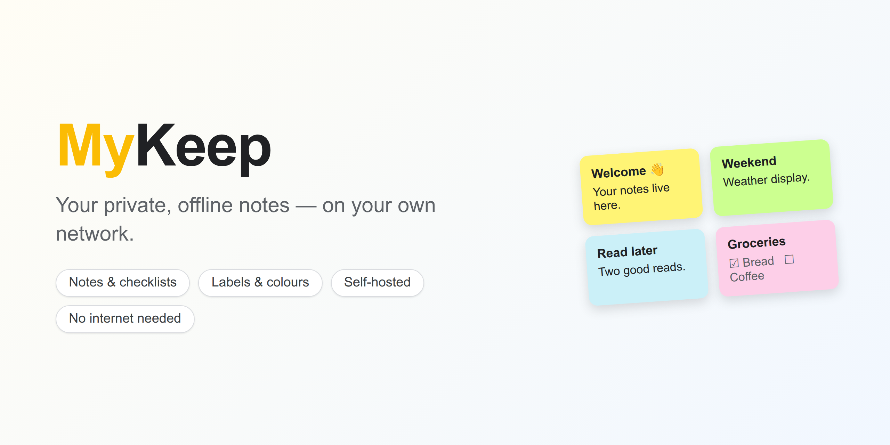

# MyKeep



Your own private notes app for your home network — a self-hosted take on Google Keep. Write notes and
checklists, color them, pin and search them, add labels and images. It runs entirely on your own machine
and **needs no internet** once it's set up.


**Curious what it's like to use?** Take the quick visual tour → **[Using MyKeep](docs/USING-MYKEEP.md)**.

## What you'll need

One thing: **Docker**, with its **Compose** feature. Docker is a free tool that runs an app in a tidy,
self-contained package so you don't have to install anything else by hand. If you don't have it yet,
follow Docker's official guide for your system: <https://docs.docker.com/engine/install/>. (Their install
includes Compose, which is what the `docker compose` command below uses.)

You'll run a few commands in a **terminal** on the machine that will host MyKeep — for example your Ubuntu
home server.

## Get it running

**1. Get the code** onto the host machine and step into the folder:

```bash
git clone https://github.com/kbennett2000/my-keep.git
cd my-keep
```

**2. Create your settings file** by copying the example:

```bash
cp .env.example .env
```

**3. Set your secret.** MyKeep signs login cookies with a secret string. Generate a random one — this
command just prints a long, random value:

```bash
openssl rand -hex 32
```

Open `.env` in any text editor and paste what that printed as the value of `SESSION_SECRET`, so the line
looks like `SESSION_SECRET=3f9c...` (your value will be different). Save the file.

**4. Start it:**

```bash
docker compose up -d
```

The first run takes a minute or two while it builds — that's normal, and it only happens once.

**5. Open it.** On any device on the same network, go to your server's address on port **8065**:

```
http://YOUR-SERVER-IP:8065
```

(Replace `YOUR-SERVER-IP` with the host machine's address on your network. Not sure what it is? Run
`hostname -I` on the host — it prints something like `192.168.1.50`.)

**6. Make your account.** The first screen lets you register a username and password. That's it — **you're
running your own notes server.** 🎉

## Everyone gets their own notes

Anyone on your network can open that address and **register their own account**. Each account's notes are
private to that person — they can't see anyone else's.

## Change the port

Prefer a different port? Edit `PORT` in your `.env` file (say `PORT=9000`), then apply it:

```bash
docker compose up -d
```

MyKeep will now answer on that port instead.

## Where your notes live

Everything you save — the notes database and any images you upload — lives in the **`data`** folder next to
`docker-compose.yml`. To **back up MyKeep, copy that folder** somewhere safe. To restore, put it back. It
survives updates and restarts on its own.

## Everyday commands

Run these from the `my-keep` folder:

```bash
docker compose logs -f          # watch what it's doing (Ctrl+C to stop watching)
docker compose restart          # restart it
docker compose down             # stop it (your notes are kept)
git pull && docker compose up -d --build   # update to the latest version
```

## If something's not right

- **It says `SESSION_SECRET` isn't set when starting.** You missed step 3 — generate a secret and put it in
  `.env`, then run `docker compose up -d` again.
- **`port is already allocated` / `address already in use`.** Something else is using port 8065. Pick another
  port (see *Change the port* above).
- **You can't reach it from another device.** Make sure that device is on the **same network**, you used the
  host's IP address (not `localhost`), and the host's firewall allows the port.

## Questions you might have

- **I forgot my password.** There's no password reset yet. The simplest fix is to register a fresh account —
  every account is separate, so no one else's notes are affected.
- **How do I back up my notes?** They all live in the `data` folder (see *Where your notes live*). Copy that
  folder somewhere safe and you have a complete backup; put it back to restore.
- **Can I export my notes to a file?** Not yet — it's on the wish list. For now, the `data` folder is your
  portable copy.
- **Can I open it from outside my home?** Keep MyKeep on your home network. It serves plain `http` (not the
  encrypted `https` that public sites use) and is built for a network you trust, so it's best not to expose
  it to the open internet.

## Good to know

- **Offline by design.** After the one-time build, MyKeep makes no calls to the internet — fonts and icons
  are bundled in. It's meant for a trusted home network (it serves plain `http`, not `https`).
