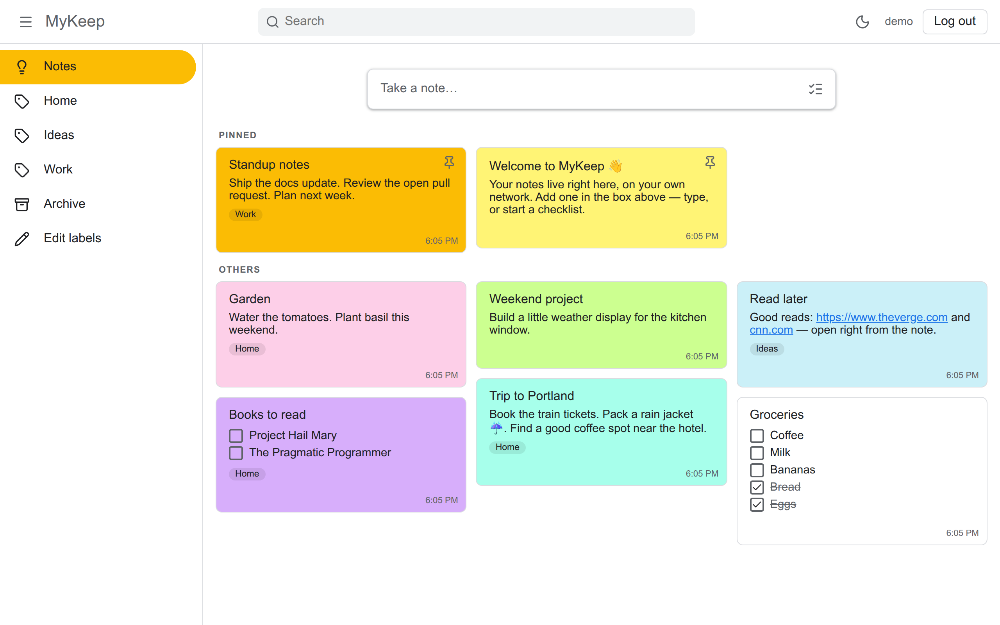
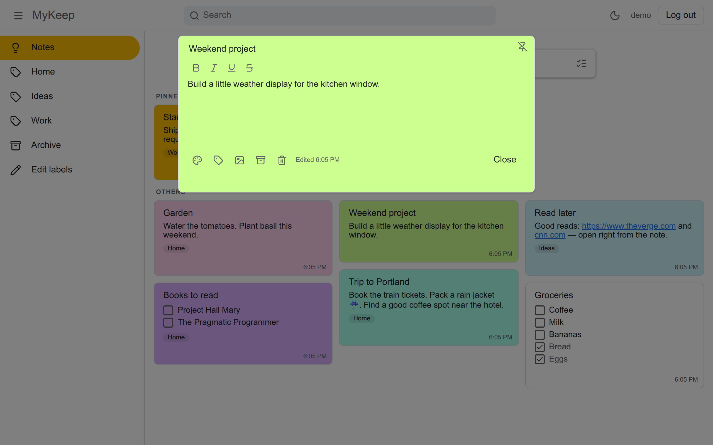
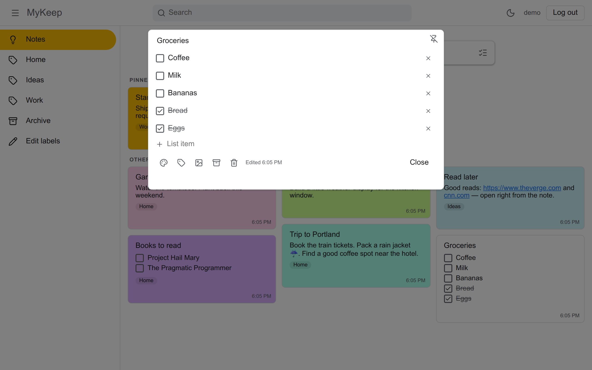
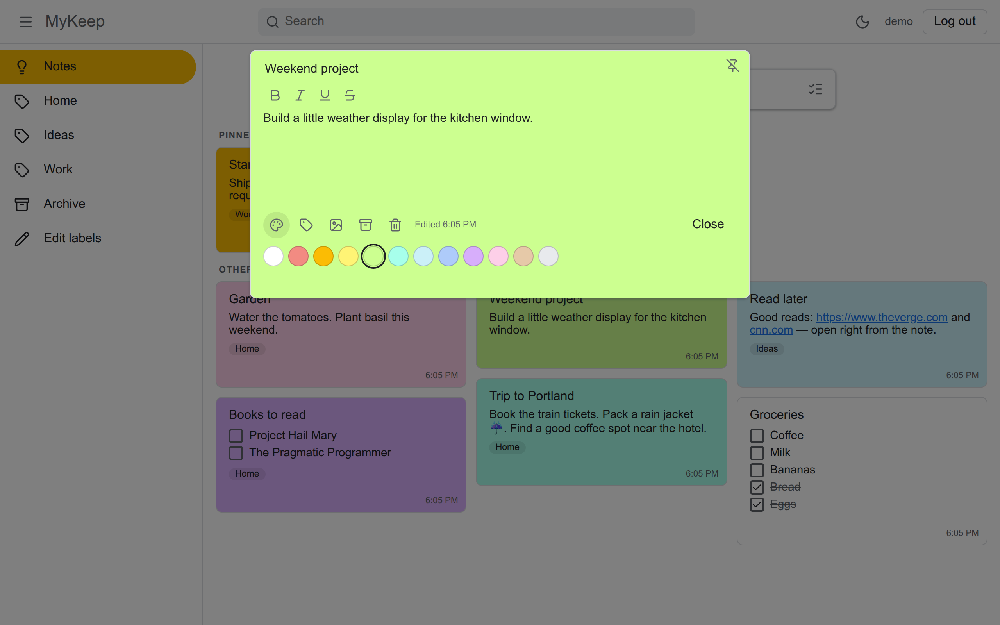
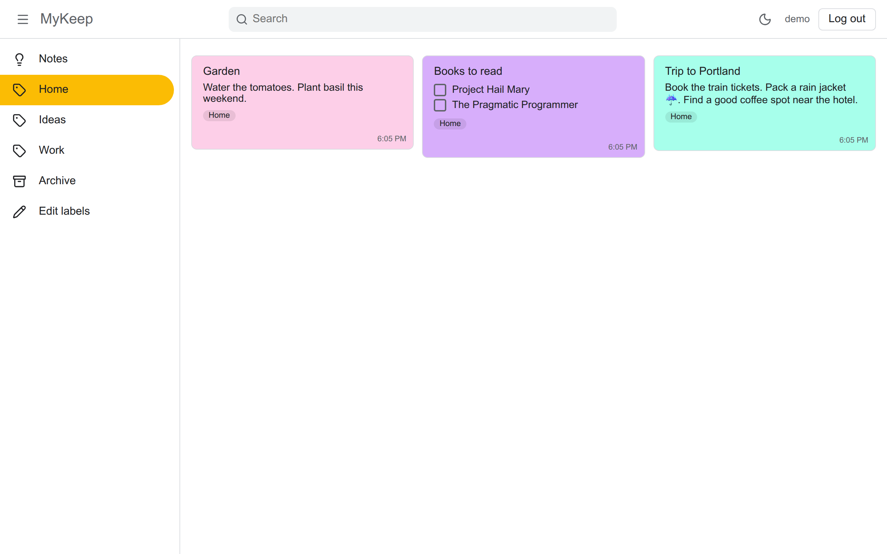
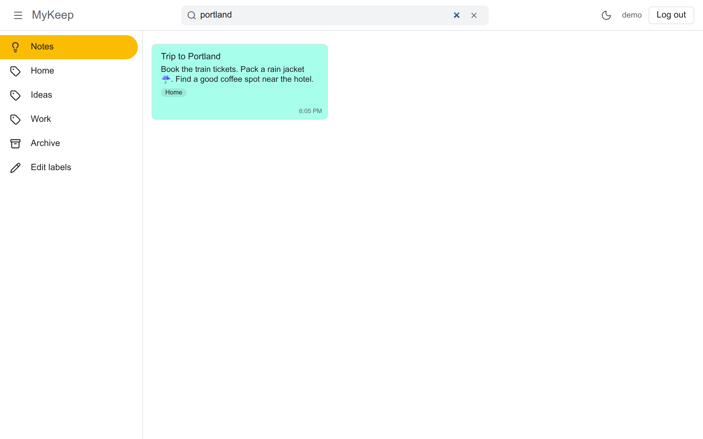
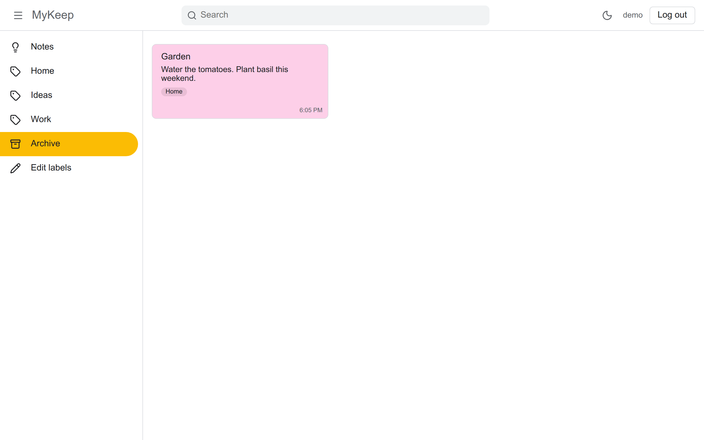
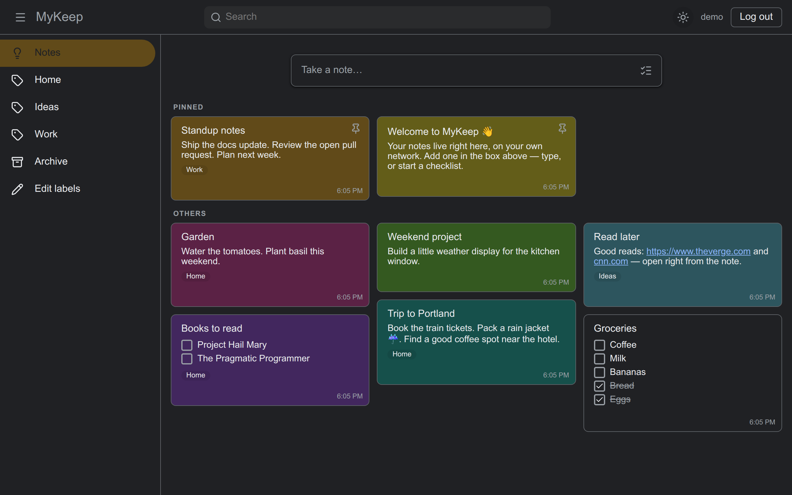
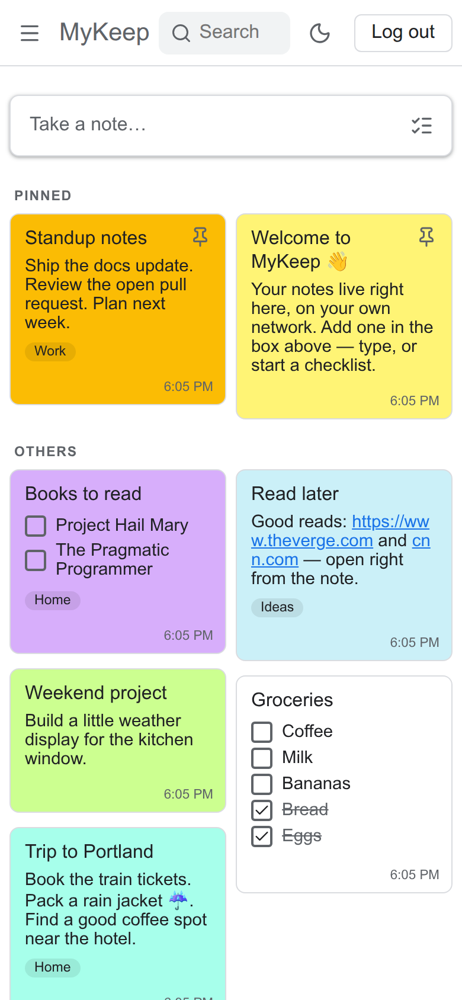

# Using MyKeep

You've got MyKeep running — nice. This is a quick picture-by-picture tour of everything you can do with it.
Nothing here is required reading; skip to whatever you're curious about.

## A quick look

This is your board. Every note you make shows up here as a card. To **add one**, click **Take a note…** at
the top, type a title and whatever's on your mind, and click **Save** — it appears on the board right away.

The notes you care about most sit up top under **Pinned** (more on that below), and everything else follows
underneath.

## Write and tidy up a note

**Click any card to open it.** Here you can change the title or the text, and use the little **B** _I_ buttons
to make words **bold**, _italic_, underlined, or struck through. Close it and your changes are saved.

Two small touches: each note shows **when you last edited it**, and if you type a web address into a note, it
becomes a **clickable link** you can open straight from the card.

## Make a checklist

Not every note is a paragraph. Start a **checklist** when you'd rather tick things off — a shopping run, a
packing list, a weekend to-do. Click the **circle** next to an item to check it; checked items slide to the
bottom so what's left is always on top.

## Color your notes

Give a note a **color** to make it stand out or to group like with like — yellow for ideas, blue for trips,
whatever makes sense to you. Open a note (or use the toolbar on a card), click the **paint icon**, and pick.

## Organize with labels

**Labels** are like folders a note can belong to — *Home*, *Work*, *Ideas*. Add labels to a note with the
**tag icon**, then click a label in the left sidebar to see just those notes. The picture above shows
everything tagged **Home** in one place.

## Find anything fast

Got a lot of notes? Type in the **Search** box at the top and the board narrows to just what matches — by
title, by text, even by checklist items. Clear the box to bring everything back.

## Tuck notes away

Done with a note but not ready to delete it? **Archive** it. It leaves your main board but stays safe — open
**Archive** in the sidebar to find it again, and bring it back any time.

## Easy on the eyes

Prefer a darker screen at night? Click the **moon** (top right) to switch to **dark mode**. MyKeep remembers
your choice for next time.

## On your phone

MyKeep works right in your phone's web browser — just visit the same address. It lays your notes out in **two
columns** so you can see plenty at a glance, and the menu tucks away behind the **☰** button to leave room.

---

That's the whole thing. It's your board now — make a note, give it a color, and make it yours.
